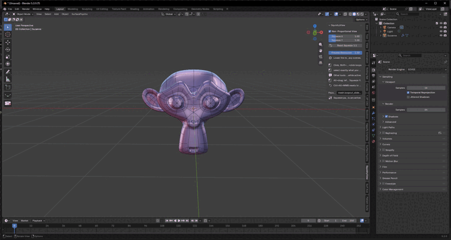

# SquishyView

Non-proportional (anisotropic) viewport projection for Blender. Squeeze or stretch
the view along X and Y to inspect and edit your models with a "squashed" view —
**visual only: it never alters the geometry.**

## Features

- **Anisotropic squeeze** of the viewport projection along X and Y (per-scene
  factors, `0.1`–`4.0`).
- **Non-destructive**: the 3D view is rendered off-screen with a scaled window
  matrix and blitted over the viewport; geometry and camera are never touched.
- **Live refresh**: camera moves, mesh edits, selections, X-Ray / shading /
  overlay changes and Quad View all update automatically.
- **Remapped mouse selection** — click, `Shift`+click and box select pick exactly
  what you see:
  - custom edit-mode box select (bmesh + BVH occlusion), safe from the crashes
    of calling `view3d.select_box` from Python;
  - with X-Ray on it selects through the mesh;
  - `Alt`+click selects edge loops / vertex loops / face strips (remapped).
- **Squeeze gestures**: `Alt`+drag adjusts the factors live; `Ctrl+Alt+MMB`
  resets to 1:1.
- **Auto-pause**: while Loop Cut, Knife or the Circle/Lasso selectors run, the
  squeeze suspends (real projection) and returns on exit. The list of tools is
  configurable in the panel.
- **Squeezed annotations**: native annotations are redrawn with the squeezed
  projection and stay aligned with the model.
- **Quad View aware**: each quadrant renders with its own matrices.

## Compatibility

- Blender **4.2 LTS** and **5.x** (tested on 4.2 and 5.2).
- The color pipeline is version-aware: in 5.x the draw handlers run after the
  viewport color management, in 4.x they do not, so the off-screen render is
  kept linear there to avoid a washed-out image.

## Installation

1. Download `squishy_view.py`.
2. Blender ▸ *Edit ▸ Preferences ▸ Add-ons ▸ Install…* and pick the file
   (or copy it into your `scripts/addons` folder).
3. Enable **SquishyView** — the panel appears in the 3D Viewport sidebar
   (`N`) under the **SquishyView** tab.

## Usage

| Action | Shortcut |
| --- | --- |
| Toggle the squeeze | `Shift+Alt+Q` |
| Adjust Squeeze X / Y | panel sliders, or `Alt`+drag: left/right = X, up/down = Y |
| Reset to 1:1 | `Ctrl+Alt+MMB` (or the panel button) |
| Remapped click / `Shift`+click | `LMB` / `Shift+LMB` |
| Remapped box select | drag `LMB` |
| Remapped loop select | `Alt`+click (edge loop / vertex loop / face strip) |
| Cancel a gesture | `ESC` (restores the previous factors) |

Notes:

- While a pause tool (Loop Cut, Knife, Circle/Lasso selectors…) is active, the
  view returns to the real projection so its preview and mouse input are
  correct; the squeeze comes back automatically when the tool ends.
- Use *Preview Resolution* to trade quality for performance on heavy scenes.

## How it works

A main-loop timer renders the 3D view off-screen with a scaled window matrix
`S · winmat` (where `S = diag(fx, fy, 1)`) and the resulting texture is drawn
over the viewport in the `POST_VIEW` draw phase. Mouse input is remapped with the
inverse affine transform, and the selection helpers (box select, loop select,
occlusion tests) reimplement Blender's picking on top of bmesh and a BVH, so
everything matches what is shown.

## License

GPL-3.0-or-later — see [LICENSE](LICENSE).
